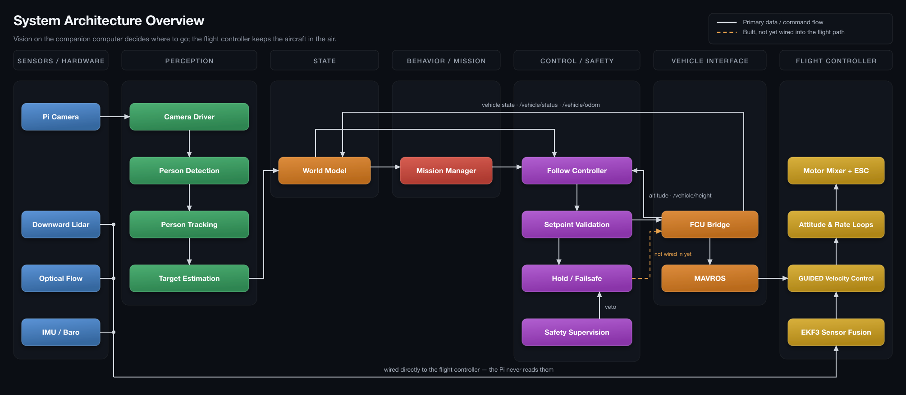
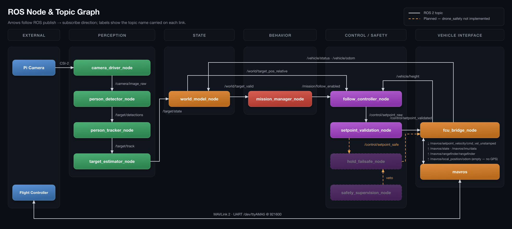
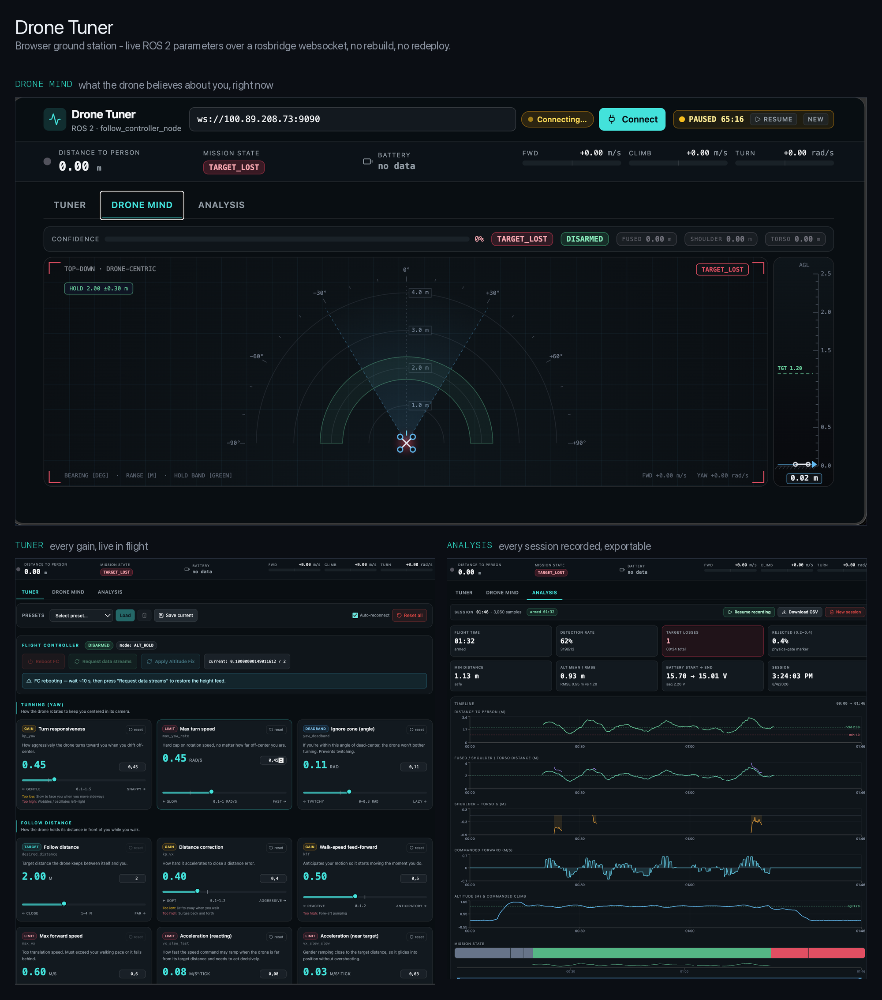

<div align="center">

# Autonomous Indoor Person-Following Drone

**A sim-to-real ROS 2 autonomy stack — from a Gazebo digital twin to a real ArduPilot quadcopter.**

Perception, world modeling, mission logic, control and safety run on a Raspberry Pi companion computer.
A separate flight controller owns stabilization and hover. Everything is developed and validated in
simulation first, then deployed to hardware — where it now flies and follows for real.

[](https://github.com/EspiroFares/Autonomous-UAV/actions/workflows/ci.yml)
[](https://docs.ros.org/en/jazzy/)
[](https://isocpp.org/)
[](https://www.python.org/)
[](https://ardupilot.org/)
[](https://gazebosim.org/)
[](https://github.com/mavlink/mavros)
[](https://opencv.org/)
[](https://developers.google.com/mediapipe)
[](LICENSE)

</div>

<!-- Hero demo video. Put your strongest clip here — the real-hardware person-following clip once edited.
A bare github.com/user-attachments/... URL on its own line renders as an inline video player on GitHub. -->

https://github.com/user-attachments/assets/7d0be21c-c6fa-4e51-9add-62b9557a809c

---

## Highlights

- **Autonomous person-following on real hardware.** The full pipeline — camera → MediaPipe Pose → tracking → distance estimation → mission logic → velocity control → ArduPilot — runs on the aircraft's Raspberry Pi 4 and follows a person in real, GPS-denied indoor flight.
- **Full sim-to-real workflow.** A complete digital twin — **Gazebo Harmonic + ArduPilot SITL + MAVROS** — runs the *exact same ROS 2 stack* that flies the real aircraft. Behavior is validated in simulation before it ever touches hardware.
- **GPS-denied stable hover.** Active disturbance rejection by fusing a **TF-Luna LiDAR** (altitude) and an **optical-flow sensor** (lateral) into the flight controller's estimator. Push the drone — it returns to position on its own. *(This milestone demo reached 120k+ impressions on LinkedIn.)*
- **Real-time perception on embedded hardware.** MediaPipe Pose at 5–7 Hz on a passively cooled Pi 4, with an end-to-end pipeline latency of **~240 ms** — down from ~1 s after systematic latency engineering (see deep-dives).
- **Fail-safe by design.** Every timer-driven node treats stale inputs as invalid; any single node crash degrades the aircraft to a stable altitude-holding hover within ~1.5 s, and the launch system respawns the node. A **single bridge node** is the only path to the flight controller, and **safety holds a veto** over mission logic.
- **Solo-built, end to end** — physics, flight dynamics, perception, control, and the full ROS 2 graph.

---

## Table of Contents

- [What it does](#what-it-does)
- [System architecture](#system-architecture)
- [Perception pipeline](#perception-pipeline)
- [Simulation stack (the digital twin)](#simulation-stack-the-digital-twin)
- [Ground station (live tuning)](#ground-station-live-tuning)
- [Engineering deep-dives](#engineering-deep-dives)
- [Technology stack](#technology-stack)
- [Project status](#project-status)
- [Repository structure](#repository-structure)
- [Getting started](#getting-started)
- [Roadmap](#roadmap)
- [Author](#author)

---

## What it does

The drone autonomously **detects a person, locks on, and follows them indoors** — where GPS is unavailable.
The companion computer turns a camera feed into a target estimate, decides what to do via a mission state
machine, and produces high-level velocity commands. The flight controller turns those into stable, hovered
flight. It holds a ~2 m following distance and a ~1.2 m lidar-referenced altitude — both live-tunable at
runtime — yaws to keep the person centered, and freezes into a safe hover the moment the target — or any
part of the pipeline — is lost.

The whole point is the **sim-to-real split**: the same nodes ran against a simulated quadcopter in Gazebo
first and fly the real one now, so the simulator is a true development and regression environment — not a toy.

---

## System architecture

The stack is organized in clean layers. Data flows up from sensors into a world model, through mission and
control logic, and back down to the flight controller — crossing the hardware boundary at exactly one place.

### System overview


### ROS 2 node / topic graph


> Both figures are generated from a single source of truth —
> `python3 docs/architecture/generate_diagrams.py` — so they stay in step with the code.

---

### Design principles (fixed from day one)

| # | Principle | Why it matters |
|---|-----------|----------------|
| 1 | **`fcu_bridge_node` is the sole gateway to the flight controller** | No other node talks to the FC. One bridge keeps the hardware boundary clean and the rest of the stack fully testable in simulation. |
| 2 | **Safety has veto** | The safety layer can block any setpoint and force a hold/failsafe at any time, overriding mission logic. |
| 3 | **ROS sends high-level commands only** | ROS outputs `vx, vy, vz, yaw_rate`. The FC keeps its inner stabilization/hover loops — ROS never reimplements them. |
| 4 | **Stability-critical sensors stay on the FC** | Optical flow and the downward rangefinder belong to the low-level flight stack and are not moved onto the Pi. |

---

## Perception pipeline

A streaming ROS 2 pipeline turns raw frames into a metric target estimate:

```
camera  ─►  person_detector   ─►  person_tracker  ─►  target_estimator  ─►  /target/state
(Pi camera     (MediaPipe Pose,     (EMA smoothing)    (pinhole geometry:
 via picamera2  shoulder landmarks)                     distance + yaw error)
 or Gazebo)
```

- **`person_detector_node`** (Python, MediaPipe Pose) — locates a person from shoulder landmarks and emits a bounding box + shoulder width in pixels. Runs inference in a background thread on the **latest frame only**, so the camera stream can never queue up stale data.
- **`person_tracker_node`** (C++) — exponential-moving-average smoothing to suppress detection jitter.
- **`target_estimator_node`** (C++) — converts pixel measurements to a **distance estimate** via a pinhole camera model, plus a normalized yaw error for steering.

Downstream, `world_model_node` fuses perception with vehicle state, `mission_manager_node` runs the
behavior state machine (`IDLE → TRACKING → FOLLOWING ↔ TARGET_LOST / SAFETY_HOLD`) with a grace period
against momentary detection dropouts, and `follow_controller_node` produces clamped, validated velocity
setpoints — including a continuous lidar-referenced altitude hold.

**On-hardware performance (Pi 4, passive cooling):** 5–7 Hz detection rate, ~240 ms latency at the tracker
output, ~350–400 ms camera-to-command.

---

## Simulation stack (the digital twin)

```
Gazebo Harmonic (physics + simulated camera)
   ↕  ArduPilot SITL (real flight-control firmware, simulated dynamics)
   ↕  MAVROS  (MAVLink ⇄ ROS 2)
   ↕  fcu_bridge_node ─► the full ROS 2 autonomy stack
```

The simulator runs **the real ArduPilot firmware** (Software-In-The-Loop), not an approximation — so flight
modes, arming logic, and the MAVLink control contract behave exactly as on hardware. Gazebo provides a
camera feed bridged into the perception pipeline via `ros_gz_bridge`, and an **animated walking actor** acts
as the follow target.

This is what makes the sim-to-real claim real: a bug caught in SITL is a bug that would have happened on the
drone — and several were (see deep-dives).

> **Demo — full autonomy stack in Gazebo + ArduPilot SITL.** The complete perception → mission → follow
> loop running against the simulated quadcopter. Since ported to real hardware — see the demo above.

https://github.com/user-attachments/assets/22fade36-4afa-4486-8f35-493470875aa7

---

## Ground station (live tuning)

A browser-based ground station connects to the aircraft over a **rosbridge websocket** and turns the whole
autonomy stack into something you can tune, watch, and review in real time — no rebuilds, no redeploys.



- **Tuner** — every controller gain is a live ROS 2 parameter; sliders push changes to `follow_controller_node`
  instantly (yaw, follow distance, altitude, safety limits) with per-parameter guidance. A Flight Controller
  panel exposes MAVROS actions: arm/mode status, **Reboot FC**, **Request data streams**, and a one-shot
  **Apply Altitude Fix**.
- **Drone Mind** — a synthetic HUD built purely from telemetry (no video): a top-down view of the tracked
  person, hold zone, camera FOV and intent, plus a side-view altitude ladder against the target height.
- **Analysis** — an in-app ring-buffer recording with synchronized distance / velocity / altitude timelines,
  a mission-state strip, computed flight stats, and CSV export for offline analysis.

Built with **React + TanStack Start** and **roslib.js**, talking to `rosbridge_server` on the Pi. Lives in its
own repository: **[follow-drone-guardian](https://github.com/EspiroFares/follow-drone-guardian)**.

---

## Engineering deep-dives

A few of the harder problems solved along the way — the kind of thing that doesn't show up in a feature list.

<details>
<summary><b>Velocity commands in the wrong reference frame — why GUIDED mode "went crazy" while LOITER was perfect</b></summary>

<br>

On hardware, LOITER hovered flawlessly, but the moment GUIDED mode engaged, the drone flew off in
directions that had nothing to do with the camera. Every sensor checked out — so the fault had to be in
what the stack was *sending*. The culprit: MAVROS interprets velocity setpoints in **LOCAL_NED (world
frame)** by default. The controller computes "forward = toward the person" in **body frame** — so "forward"
was silently a fixed compass direction. As the drone yawed to track the person, its translation direction
never rotated with it: it spiraled while chasing an error it could never correct. One line in the MAVROS
config (`mav_frame: BODY_NED`) fixed it. The lesson generalizes: a controller and its executor must agree
on the reference frame, and that contract lives in configuration, not code.

</details>

<details>
<summary><b>Cutting perception latency from ~1 s to 240 ms — rate was never the bottleneck</b></summary>

<br>

The follower felt sluggish and overshot its turns, and the obvious suspect was the 5–7 Hz detection rate on
the Pi. Profiling the pipeline told a different story: the *rate* was fine — the *data was a second old*.
The latency budget: a depth-10 QoS queue in front of MediaPipe (~330 ms of always-stale frames, since the
detector processed the **oldest** frame of a queue that never drained), inference (~150 ms), an aggressive
EMA smoother (~360 ms of filter lag), and four unsynchronized 10 Hz timer hops (~250 ms). Fixes: QoS depth 1
+ BEST_EFFORT on image topics, latest-frame-only threading in the detector, EMA α 0.3 → 0.6, camera 30 → 15 fps
(feeding frames that were only thrown away was pure CPU heat). Result: ~240 ms at the tracker with detection
rate unchanged — and a drone that turns toward where you are, not where you were a second ago.

</details>

<details>
<summary><b>Altitude hold that only worked in LOITER — and the fix that had never actually run</b></summary>

<br>

In GUIDED mode the drone slowly wandered in altitude, while LOITER held it perfectly. Root cause #1:
streaming `vz = 0` velocity commands doesn't mean "hold altitude" — it means "hold zero climb rate," which
integrates every small EKF velocity bias into an unanchored random walk. LOITER holds an altitude *position*;
the command stream had replaced that with something weaker. The fix was a continuous P-loop on measured
height. Root cause #2 made it interesting: the loop read altitude from `/mavros/local_position/odom` — which
is **permanently empty on a GPS-denied vehicle**, because ArduPilot never sets an EKF origin and therefore
never emits `LOCAL_POSITION_NED`. The altitude controller had silently never executed. The final design reads
the downward lidar directly (which is also the better reference for "~1.2 m above the floor") — and a
deadband was deliberately *removed*, since a deadband on a velocity-commanded altitude loop creates a
drift-and-correct limit cycle. Continuous small corrections are exactly what LOITER does internally.

</details>

<details>
<summary><b>GPS-denied stable hover: a feedback loop hiding in the EKF logs</b></summary>

<br>

Indoor flight has no GPS, so position must come from a downward **TF-Luna LiDAR** (Z) and an
**optical-flow sensor** (X/Y) fused into ArduPilot's EKF3 estimator. Early hover was unstable and oscillated.
Digging into the **EKF3 dataflash logs** revealed the optical-flow and gyro contributions were effectively
**180° out of phase** — the correction was reinforcing the disturbance instead of cancelling it, a positive
feedback loop. Fixing the orientation/sign of the fused signal turned the oscillation into crisp **active
disturbance rejection**: nudge the drone and it drives itself back to where it started.

</details>

<details>
<summary><b>Monocular distance estimation — and a 3× calibration bug that drove the drone into its target</b></summary>

<br>

Range to the target is estimated from a **pinhole camera model** using the person's shoulder width in pixels.
During SITL testing the drone kept accelerating straight through the target instead of holding distance.
The cause: the camera's **focal length was hardcoded for the wrong field of view**, so every distance estimate
came out **~3× too large** — the controller always believed the target was farther than the stop distance and
never slowed down. Found it by recording the pipeline with `ros2 bag` and cross-referencing the ArduPilot
crash logs, then recomputed the focal length from the camera's actual horizontal FOV. A reminder that a
perception bug shows up as a *control* failure.

</details>

<details>
<summary><b>GUIDED-mode takeoff vs. a continuous setpoint stream</b></summary>

<br>

ArduPilot's GUIDED mode requires a continuous velocity-setpoint stream as a keepalive. But that same stream
(`vz = 0`) silently **overrides an in-progress `NAV_TAKEOFF`** — the vehicle would arm, accept the takeoff,
never actually climb, and then auto-disarm on the ground-idle safety timer (a plain disarm, *not* a crash).
Isolating this required separating ArduPilot's own behavior from the ROS stack's, and it surfaced a real
ordering constraint in the offboard-control contract that the bridge node has to respect.

</details>

<details>
<summary><b>A multi-week altitude bob that lived in a single estimator parameter</b></summary>

<br>

For weeks the drone refused to hold a clean altitude in GUIDED — it bobbed ~10–15 cm and, worse, seemed
unable to climb past ~1.1 m, while STABILIZE climbed freely. Stack, battery, surface-tracking mode and a
dozen parameters were eliminated one by one from flight logs. The real cause was in the EKF3 vertical
channel: propwash and airframe vibration were corrupting the IMU-derived vertical velocity, and the estimator
was trusting it over the clean lidar. Down-weighting that vibration-corrupted velocity and tightening the
rangefinder's trust (`EK3_RNG_M_NSE`, `RNGFND_FILT`) let the estimator lean on the lidar it should have
trusted all along — height-hold standard deviation during motion dropped to ~5 cm. The lesson: not every
"control" problem is in the controller — sometimes the loop is fine and the *estimate* it closes on is the bug.

</details>

<details>
<summary><b>The drone dipped every time it flew forward — a downward lidar that lies when the airframe tilts</b></summary>

<br>

With altitude hold finally solid in a hover, a subtler artifact showed up in the follow: the drone sank a few
centimeters every time it accelerated forward and recovered as it stopped — "forward = down, backward = up."
Flight-log analysis ruled out a control limit cycle (altitude noise was nearly identical moving vs. hovering),
which pointed at geometry. To translate, a multirotor pitches; the body-fixed downward lidar then measures a
**slanted** range, `height / cos(pitch)`, and reads *too high* — so the altitude P-loop saw "too high" and
commanded down, actively driving the dip. The fix projects the raw range back onto vertical using the FC's
attitude quaternion (`height = range · cos(pitch) · cos(roll)`, the `R₃₃` term) before it reaches the
controller, with a graceful fallback to the raw range if attitude is briefly unavailable. The directional
coupling vanished — measured forward-vs-backward drift dropped to noise.

</details>

<details>
<summary><b>Yaw that was either too slow or oscillating — until it accounted for distance</b></summary>

<br>

Steering-to-center felt sluggish when tracking someone at range, yet twitchy and oscillation-prone up close.
The two complaints share one cause: yaw is driven by the *bearing* angle `atan2(y, x)`, and at close range a
small sideways step produces a large bearing swing — so a fixed gain over-reacts near the drone and
under-reacts far away. The control law now scales the yaw gain with distance (gentle inside a reference
radius, full authority beyond it, with a floor so it never stops facing you). Combined with a bearing-based —
never lateral-offset — error, it holds a smooth lock across the whole follow envelope.

</details>

---

## Technology stack

| Layer | Technology |
|-------|-----------|
| **Framework** | ROS 2 Jazzy (CycloneDDS) |
| **Languages** | C++17 (`rclcpp`), Python 3 |
| **Perception** | OpenCV 4, MediaPipe Pose, `cv_bridge`, `picamera2` |
| **Flight control** | ArduPilot (Copter), MAVLink 2 via MAVROS over UART |
| **Simulation** | Gazebo Harmonic, ArduPilot SITL, `ros_gz_bridge` |
| **Build / tooling** | CMake, `ament_cmake`, colcon |
| **Ground station** | React + TanStack Start, roslib.js, `rosbridge_server` |
| **Hardware** | Raspberry Pi 4 (Ubuntu 24.04, native) · ArduPilot FC · Pi Camera · TF-Luna LiDAR · optical-flow sensor |

---

## Project status

Honest split between what runs in simulation and what's proven on the real aircraft.

| Capability | Simulation (Gazebo + SITL) | Real hardware |
|-----------|:--------------------------:|:-------------:|
| Stable hover / position hold (GPS-denied) | ✅ | ✅ active disturbance rejection |
| Full perception pipeline (MediaPipe Pose → distance) | ✅ end-to-end | ✅ 5–7 Hz on the Pi, ~240 ms latency |
| Mission state machine + follow control | ✅ end-to-end | ✅ flight-tested person following |
| Lidar-referenced altitude hold in GUIDED | — | ✅ |
| `fcu_bridge_node` (MAVROS gateway) | ✅ | ✅ over UART |
| Live parameter tuning (ROS params + web dashboard) | ✅ | ✅ runtime, no rebuild |
| Stale-data watchdogs + crash-safe degradation | — | ✅ any node crash → stable hover |
| Safety supervisor / failsafe nodes | 🔧 next build target | 🔧 next build target |

**Verification.** Every push builds the whole workspace in a ROS 2 Jazzy container and runs
24 unit tests, `cppcheck`, and the ROS linters. The tests cover the two places where a wrong
number does real damage: the monocular range model (pinhole fit, median filter, and the
physics gate that rejects impossible target motion) and the velocity envelope that
`setpoint_validation_node` applies to every command before it reaches the flight controller.
A separate job regenerates the architecture diagrams and fails if the committed figures have
drifted from the code.

**Component breakdown**

- **Done:** `drone_interfaces` (custom messages) · full perception pipeline (`camera_driver`, `person_detector`, `person_tracker`, `target_estimator`) · `world_model` · `mission_manager` · `follow_controller` with altitude hold · `setpoint_validation` · `fcu_bridge` · single-command launch with auto-respawn · mock nodes for hardware-free testing · runtime-tunable ROS parameters · browser tuning dashboard (rosbridge) · CI with unit tests on the range model and the velocity envelope
- **Next:** `safety_supervision_node`, `hold_failsafe_node` (the `drone_safety` package) · preflight check script · camera calibration

---

## Repository structure

<details>
<summary>Expand tree</summary>

<br>

```text
Autonomous-UAV/
├── docs/architecture/        # Diagram generator (generate_diagrams.py) + rendered SVG/PNG
└── software/drone_ws/src/
    ├── drone_interfaces/     # Custom .msg definitions (built first)
    ├── drone_perception/     # Camera → MediaPipe Pose → tracker → distance estimate
    ├── drone_state/          # fcu_bridge, world_model, mock FC/target
    ├── drone_behavior/       # Mission state machine
    ├── drone_control/        # Follow controller (incl. altitude hold) + setpoint validation
    └── drone_bringup/        # Launch (MAVROS + stream setup + full stack, respawn)

drone_safety/ (safety supervisor + failsafe) is designed but not written yet — see Project status.
```

</details>

---

## Getting started

The stack runs natively on Ubuntu 24.04 with ROS 2 Jazzy. On the Raspberry Pi, CycloneDDS is required
(`export RMW_IMPLEMENTATION=rmw_cyclonedds_cpp`).

<details>
<summary>Build the workspace</summary>

<br>

```bash
cd software/drone_ws
colcon build            # drone_interfaces builds first automatically
source install/setup.bash
```

</details>

<details>
<summary>Fly the real aircraft</summary>

<br>

One launch file brings up MAVROS (UART to the FC), requests the FC data streams, and starts all ten
nodes with auto-respawn:

```bash
ros2 launch drone_bringup real_chain.launch.py
```

Verify before arming: `/vehicle/height` is publishing (~0.3 m on the ground), `/target/detections` at
5–7 Hz. Then: arm in LOITER over open floor → take off → throttle to mid → switch to GUIDED. The ROS stack
takes over; the LOITER switch is the manual override at all times.

</details>

<details>
<summary>Run the Gazebo + ArduPilot SITL simulation</summary>

<br>

Prerequisites: ArduPilot SITL (`sim_vehicle.py`), the `ardupilot_gazebo` plugin, and Gazebo Harmonic.

1. **Gazebo** (server + GUI) with the warehouse world.
2. **ArduPilot SITL** — `sim_vehicle.py -v ArduCopter -f gazebo-iris --model JSON --out tcpin:0.0.0.0:5770`
3. **MAVROS** — `ros2 launch mavros apm.launch fcu_url:=tcp://127.0.0.1:5770`
4. **Camera bridge** — `ros2 run ros_gz_bridge parameter_bridge ...camera...image`
5. **Autonomy stack** — the same nodes as on hardware.

For a hardware-free look at the architecture, the mock nodes (`mock_fcu_node`, `mock_target_node`)
replace the FC and the perception pipeline respectively.

</details>

---

## Roadmap

- [x] End-to-end mock chain
- [x] Full perception pipeline (MediaPipe Pose)
- [x] Gazebo + ArduPilot SITL digital twin with `fcu_bridge_node`
- [x] GPS-denied stable hover with disturbance rejection on real hardware
- [x] Raspberry Pi 4 companion-computer integration (native, no container)
- [x] Autonomous person-following on the real aircraft
- [x] Stale-data watchdogs — crash-safe degradation to hover
- [x] Runtime-tunable ROS parameters + browser tuning dashboard
- [x] CI: workspace build, unit tests and linters on every push
- [ ] Safety supervisor + failsafe (`drone_safety`)
- [ ] Preflight check script
- [ ] Camera calibration (metric distance accuracy)

---

## Author

**Fares Espiro** — M.Sc. student in Autonomous Systems @ Linköping University.
Robotics · Computer Vision · Embedded AI. Building robots end-to-end, from physics simulation to sim-to-real deployment.

[](https://linkedin.com/in/espiro-fares)
[](https://github.com/EspiroFares)
[](mailto:faresespiro535@gmail.com)
